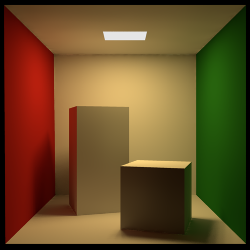

# povrayst

Declarative raytracing in Typst



A [Typst](https://typst.app) plugin that embeds the
[POV-Ray 3.8](http://www.povray.org) ray-tracer, compiled to
WebAssembly via [Emscripten](https://emscripten.org). Write a POV-Ray
scene in your `.typ` document and get a rendered image.

Feel free to read the [documentation](test/documentation.pdf) to see more examples and options.


## Usage

````typst
#import "@preview/povrayst:0.1.1": pov, render
#show raw.where(lang: "povray"): pov

```povray
camera { location <0, 2, -5> look_at 0 }
light_source { <4, 6, -4> rgb 1.2 }
sphere { 0, 1 pigment { rgb <1, 0.4, 0.15> } }
```

// Or load from a file:
#render(read("scene.pov"))

````

`pov(code, ..kwargs)` accepts the scene as a raw block or a string;
`render(scene, ..kwargs)` accepts a string only (use it with
`read()`). Both take the same ~25 keyword arguments (width, height,
quality, antialiasing, gamma, tracing depth, partial-render section,
includes, ...). 

### Syntax highlighting

The package ships [`povray.sublime-syntax`](pkg/povray.sublime-syntax)
covering the full POV-Ray SDL, exposed through the `highlight` show
rule. Apply it once at the top of your document:

```typst
#import "@preview/povrayst:0.1.1": pov, render, highlight
#show: highlight
#show raw.where(lang: "povray"): pov
```

After this, every fenced ` ```povray ``` ` block in the document
(including the ones rendered via the `pov` show rule above) is
highlighted by Typst's `syntect` integration — no extra file to copy.

## Config reference

Every keyword argument to `render()` / `pov()`, its default, and the
POV-Ray option it maps to (verbatim from POV-Ray's `.ini` /
[command-line reference](https://www.povray.org/documentation/view/3.7.1/219/)).
Passing `none` suppresses the flag so POV-Ray's own default stays in
force. The plugin runs single-threaded (`Work_Threads=1`), with no
display (`-D`), and returns raw RGBA pixels — so `compression` is moot.

| kwarg | default | POV-Ray option | effect |
|-------|---------|----------------|--------|
| **Includes** | | | |
| `includes` | `(:)` | Typst-side `#include` expansion | dictionary `{name: content}` spliced before parsing |
| **Output resolution** | | | |
| `width` | `800` | `Width` | image width in pixels |
| `height` | `600` | `Height` | image height in pixels |
| **Quality** | | | |
| `quality` | `9` | `Quality (0–11)` | `0` ambient only, `2` +shadows, `5` +reflection, `9` full radiosity |
| **Antialiasing** | | | |
| `antialias` | `true` | `Antialias=on/off` | master switch for adaptive supersampling |
| `aa-threshold` | `0.3` | `Antialias_Threshold` | colour delta that triggers extra samples; lower = smoother |
| `aa-method` | `2` | `Sampling_Method (1/2/3)` | `1` fixed grid, `2` adaptive recursive, `3` generic oversampling (3.8+) |
| `aa-depth` | `3` | `Antialias_Depth (1–9)` | recursion depth; up to depth² samples/pixel |
| `aa-jitter` | `true` | `Jitter=on/off` | randomise sub-pixel positions to break up aliasing |
| `aa-jitter-amount` | `none` | `Jitter_Amount` | jitter magnitude 0.0–1.0 |
| `aa-gamma` | `none` | `Antialias_Gamma` | gamma used when comparing sub-sample colours |
| **Gamma** | | | |
| `display-gamma` | `none` | `Display_Gamma` | gamma the final image is rendered *for* |
| `file-gamma` | `none` | `File_Gamma` | gamma assumed for `rgb <...>` colour literals in the scene |
| **Tracing** | | | |
| `max-trace-level` | `none` | `Max_Trace_Level` | cap on reflection / refraction ray depth |
| `bounding` | `none` | `Bounding=on/off` | toggle automatic bounding-slab acceleration |
| `bounding-threshold` | `none` | `Bounding_Threshold` | minimum children before an auto-bound is built |
| `remove-bounds` | `none` | `Remove_Bounds=on/off` | discard user `bounded_by` when POV-Ray's own bound is tighter |
| `split-unions` | `none` | `Split_Unions=on/off` | split non-overlapping `union` children into separate bounds |
| **Partial render** | | | |
| `start-row` | `none` | `Start_Row` | render only this pixel-row range |
| `end-row` | `none` | `End_Row` | (integers ≥ 1 or fractions 0..1) |
| `start-column` | `none` | `Start_Column` | pixel-column range |
| `end-column` | `none` | `End_Column` | |
| **Output encoding** | | | |
| `output-alpha` | `false` | `Output_Alpha=on/off` | emit an alpha channel; use with `background { color rgbt <...,1> }` |
| `compression` | `none` | `Compression (0–9)` | ignored — output is raw RGBA, not PNG |
| **Escape hatch** | | | |
| `extra` | `()` | raw command strings appended verbatim | any flag from POV-Ray's [`.ini` / CLI reference](https://www.povray.org/documentation/view/3.7.1/219/) |

## Performance

Gallery render times under native `typst compile` on an AMD Ryzen 9
9950X (Zen 5, 5.7 GHz), median of 3 samples:

| scene | resolution | AA (threshold / depth) | median time |
|-------|------------|------------------------|-------------|
| `basic.pov`   | 480×300 | —       | 2.3 s |
| `csg.pov`     | 480×360 | —       | 3.4 s |
| `julia.pov`   | 420×315 | 0.4 / 2 | 4.3 s |
| `clebsch.pov` | 480×360 | —       | 4.1 s |
| `gyroid.pov`  | 520×390 | 0.7 / 2 | 19.3 s |
| `knot.pov`    | 480×320 | 0.7 / 2 | 15.1 s |
| `hopf.pov`    | 600×400 | 0.7 / 2 | 7.7 s |
| `caustic.pov` | 360×270 | —       | 13.5 s |

## Limitations

- **No filesystem**: `#include`, `image_map`, `height_field`,
  `bump_map` of external files won't work—the VFS returns null on all
  reads. `#include` is handled by Typst-side text expansion (see
  `expand-includes` in `pkg/povray.typ`), but image maps have no
  workaround yet.
- **Single-threaded**: `Work_Threads=1` always. Multi-core
  parallelism isn't possible under wasmi.
- **One output frame**: animation options are forwarded but only the
  last frame is captured.
- **Missing include hangs**: if a scene references an `#include` name
  not in the `includes` dict, POV-Ray's `Error()` function is a no-op
  (throw-stripped) so the parser loops forever instead of exiting
  cleanly.

## Building from source

Pre-built `pkg/povray.wasm` is shipped with the package, so end users
don't need to build anything. For build instructions, the patch tour,
and the POV-Ray version details, see [`NOTES.md`](NOTES.md).

## License

AGPL-3.0-or-later (same as POV-Ray 3.8).
